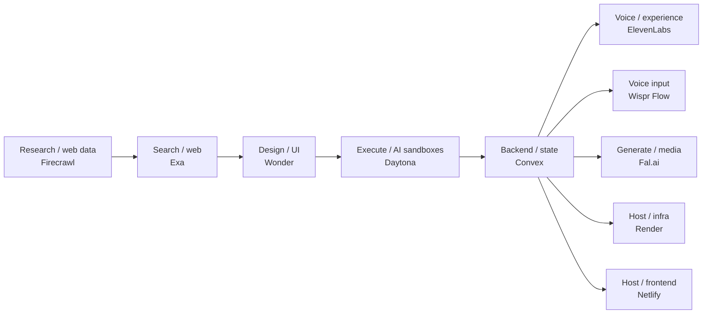

# Sponsor cheat sheet — Cursor Hackathon Serbia

**Event:** Belgrade · 12 September 2026 · one day  
**Build in:** [Cursor](https://cursor.com) (host / editor — not a sponsor)  
**Register:** [luma.com/ghvnbjlx](https://luma.com/ghvnbjlx)

Use this when you pick a stack. On the site, **Guide** (`/hackathon/guide`) is the participant brief; **Stack** (`/hackathon/stack`, or `/stack` on the hackathon subdomain) groups sponsors by area, not a left-to-right pipeline. The path below is only a reading aid.

Credits and prizes below are **only what is confirmed**. Everything else is a public free tier or TBD — not a promised hackathon gift.

---

## 1. Global map

Left to right is a build path you can follow in one day. You do **not** need every box.

| Area | Sponsor | Job on hack day |
|------|---------|-----------------|
| Research / web data | **Firecrawl** | Turn live websites into clean markdown or JSON for the app or agent |
| Search / web | **Exa** | Neural search for sources the agent does not already have |
| Design / UI | **Wonder** | Design the interface as production React + Tailwind, not a handoff mockup |
| Execute / AI sandboxes | **Daytona** | Run AI-generated or user-untrusted code in an isolated machine |
| Backend / state | **Convex** | Database, auth, realtime sync — the app’s memory |
| Voice / experience | **ElevenLabs** | Speech in, speech out, or a full voice agent |
| Voice input | **Wispr Flow** | Dictate into Cursor — not speech inside the product |
| Generate / media | **Fal.ai** | Image, video, and audio models through one API |
| Host / infra | **Render** | Public demo URL: web service, static site, Postgres, workers |
| Host / frontend | **Netlify** | Public site from Git, deploy previews, functions |

**Overlap (read this once)**

- **Convex vs Render / Netlify:** Convex can be the whole backend (and often the deploy target for the API). Render and Netlify are conventional hosting — the HTTPS URL judges open.
- **Daytona is not production hosting.** It is a disposable computer for agents and untrusted code. Ship the product on Convex and/or Render or Netlify.
- **Firecrawl scrapes a URL you already have. Exa searches** for sources you do not.
- **ElevenLabs is speech in the product. Wispr Flow is how you dictate into Cursor.**
- **Fal.ai generates media.** It is not search and not hosting.
- **Wonder is the design canvas that ships as React.** Fal.ai generates media. They are not the same job.
- **Cursor** is how you write and wire all of this. It is the host tool, not a sponsor product.

---

## 2. Area cards

### Research / web data — Firecrawl

**One-liner:** Give the agent or app live web pages as clean data, not a pile of HTML.

**Products / technologies**

- **Scrape** — one URL → markdown, HTML, or structured JSON  
- **Crawl** — follow links from a start URL  
- **Map** — list URLs on a site without scraping bodies  
- **Search** — web search, optional full-page content  
- **Extract (JSON format)** — LLM-shaped fields from a page  
- **Interact** — click, fill, paginate in a hosted browser  
- **Monitor** — re-check a page later (usually overkill for one day)  
- **MCP / CLI / API** — including [keyless](https://www.firecrawl.dev/blog/firecrawl-keyless-launch) calls for small usage  

**Ship in a day**

1. RAG over a docs site or blog (scrape → store chunks → answer in the app).  
2. Research agent: search + scrape sources, then summarize with citations.  
3. Structured watchlist: extract price / title / date from a few known URLs.  
4. “What’s new” brief: map a docs tree, scrape changed pages, post a digest.  
5. Form-heavy site: Interact to reach the data behind a click or login wall you are allowed to use.

**Start here**

- Product: [firecrawl.dev](https://www.firecrawl.dev)  
- Pricing / credit costs: [firecrawl.dev/pricing](https://www.firecrawl.dev/pricing)  
- Cursor: Firecrawl MCP (`https://mcp.firecrawl.dev/v2/mcp`) or CLI — one-click **Add to Cursor** on `/hackathon/stack`  

**What you get**

- Hackathon event credits: **TBD** (do not assume a pack until organizers publish a code).  
- Start today: public free tier — **1,000 credits / month** (keyless or after signup). Scrape/crawl/map are typically 1 credit per page; JSON extract and enhanced mode cost extra.

---

### Execute / AI sandboxes — Daytona

**One-liner:** Isolated computers that boot in milliseconds so agents can run code without touching your laptop.

**Products / technologies**

- **Sandboxes** — isolated Linux (also VM / GPU options) with filesystem, network, processes  
- **Code interpreter / `process.exec` / `code_run`** — run generated code and stream output  
- **Snapshots** — freeze and restore an environment  
- **Computer use** — programmatic Linux / Windows / macOS desktops  
- **SDKs** — Python, TypeScript, and others; **MCP** so Cursor can drive Daytona  
- **Git, files, LSP** — agent-facing APIs, not a PaaS for your Next.js app  

**Ship in a day**

1. Coding agent: model writes a function → Daytona runs tests → you show the trace.  
2. Safe “user pasted a script” runner (notebook, kata, interview tool).  
3. Eval harness: same prompt, N isolated runs, compare scores.  
4. Data-analysis agent: upload a CSV, sandbox plots a chart, app displays it.  
5. Parallel experiments: fan out a few sandboxes instead of one local Docker mess.

**Start here**

- App: [app.daytona.io](https://app.daytona.io/)  
- Docs: [daytona.io/docs](https://www.daytona.io/docs/)  
- SDK sketch: `pip install daytona` / create sandbox → `exec` → delete  

**What you get (confirmed)**

- **Every participant:** $100 Daytona platform credits.  
- **Winners:** $3,000 / $2,000 / $1,000 in credits (1st / 2nd / 3rd).  
- **Prize track:** Best app that uses Daytona (shown on the Prizes tab).  
- **TBD:** how you redeem winner credits (code vs dashboard grant). Organizers will say on the day.  
- Public start: Daytona also advertises free compute on signup — that is their product free tier, not an extra hackathon bounty.

---

### Backend / state — Convex

**One-liner:** TypeScript backend with a database and live updates — skip standing up Postgres + sockets for the demo.

**Products / technologies**

- **Database** — documents + indexes (relational-style IDs, not a giant nested blob)  
- **Queries / mutations / actions** — read, write, and Node/external API work  
- **Realtime** — `useQuery` stays in sync; no hand-rolled WebSockets  
- **Auth** — plug in a provider; scope data by user  
- **File storage, cron, scheduler** — uploads and background work  
- **Components** — packaged features (e.g. rate limit, extra integrations)  
- **AI-friendly** — rules/prompts and [hackathon resources](https://www.convex.dev/hackathons/resources)  

**Ship in a day**

1. Live multiplayer or chat — messages appear for everyone without refresh.  
2. Agent memory: store runs, tool results, and user threads in Convex.  
3. Auth’d app: sign in, each user only sees their rows.  
4. Live dashboard: Firecrawl or a webhook writes rows; the UI ticks.  
5. Job list: mutation enqueues work; action calls an API; query shows status.

**Start here**

- [convex.dev](https://www.convex.dev) · `npm create convex@latest`  
- Hackathon pack: [convex.dev/hackathons/resources](https://www.convex.dev/hackathons/resources)  
- Docs: [docs.convex.dev](https://docs.convex.dev)  
- If you get a coupon later: Team Settings → Billing (only when a code is issued).

**What you get (confirmed)**

- **Prize track — Best app that uses Convex:** 1st **100.000 RSD**, 2nd **50.000 RSD**. You must actually use Convex.  
- Participant coupon / Pro code: **TBD**.  
- Start today: Convex is free for small teams — that is their public tier, not a published event credit.

---

### Voice / experience — ElevenLabs

**One-liner:** Production speech: text-to-speech, speech-to-text, and full voice agents.

**Products / technologies**

- **Text to Speech (TTS)** — including low-latency Flash models and streaming  
- **Speech to Text (Scribe)** — transcription  
- **Agents platform** — conversational voice agents (turn-taking, tools, phone)  
- **Voice clone / design / remix** — custom voices (keep it tasteful and allowed)  
- **Also on the API:** music, sound effects, dubbing, voice changer, isolation  

**Ship in a day**

1. Voice tutor or coach: user talks → STT → your logic → TTS reply.  
2. Demo narration: generate a walkthrough of the product for judges.  
3. Accessibility: “read this page / this result aloud.”  
4. Voice agent with tools: “search the docs” (Firecrawl) or “save this” (Convex).  
5. Multilingual greeting or dubbed clip for a Serbia + English demo.

**Start here**

- [elevenlabs.io](https://elevenlabs.io) · [Developer / API](https://elevenlabs.io/developer)  
- Sign up: [elevenlabs.io/app/sign-up](https://elevenlabs.io/app/sign-up)  
- Agents quickstart: [docs — Eleven Agents](https://elevenlabs.io/docs/eleven-agents/quickstart)  

**What you get**

- Hackathon event credits or prize track: **TBD**.  
- Start today: public free tier — **10,000 credits** on signup (no card required, per their developer signup). That is ElevenLabs’ free tier, not a confirmed event grant.

---

### Host / deploy — Render

**One-liner:** Ship a public URL from Git — web apps, static sites, databases, and workers.

**Products / technologies**

- **Web services** — deploy a server from a repo (TLS, auto-deploy)  
- **Static sites** — frontend + CDN  
- **Render Postgres** — managed SQL when you are not on Convex  
- **Redis, cron, background workers** — queues and scheduled jobs  
- **Private services / Workflows** — extra pieces if you already know them  

**Ship in a day**

1. Put the demo on `*.onrender.com` so judges do not need localhost.  
2. Host a thin API next to a Convex or Daytona-backed agent.  
3. Postgres + a classic fullstack app if you skip Convex.  
4. Worker that polls Firecrawl or processes uploads off the request path.  
5. Static landing + a separate API service, both from GitHub.

**Start here**

- [render.com](https://render.com)  
- New service from GitHub; free TLS and a public URL  

**What you get**

- Hackathon event credits or prize track: **TBD**.  
- Start today: Render’s **public free tier** (web/static/Postgres options — check current limits on their site). Not a confirmed event credit pack.

---

### Search / web — Exa

**One-liner:** Neural web search so the agent finds sources — not just a URL you already have.

**Products / technologies**

- **Search** — live web, people, companies, and code  
- **Contents** — token-efficient excerpts from result URLs  
- **Research / agent** — multi-step search with citations  
- **MCP** — hosted at `https://mcp.exa.ai/mcp`  

**What you get (confirmed)**

- **Every participant:** $50 Exa credits.

**Start here**

- [exa.ai](https://exa.ai/) · [Docs](https://exa.ai/docs) · Add to Cursor on `/hackathon/stack`

---

### Design / UI — Wonder

**One-liner:** Design on a canvas that is already production React + Tailwind — not a handoff mockup.

**Products / technologies**

- Canvas, layers, and components that map 1:1 to code  
- AI chat to generate and iterate the design  
- Export production-ready React + Tailwind (or CSS)  
- **MCP** — hosted at `https://mcp.wonder.so/mcp` (browser sign-in after install)

**Ship in a day**

1. Design the demo UI in Wonder, then ship the React it already is.  
2. Iterate a landing or product screen with AI on the canvas.  
3. Ask Cursor to pull or push design changes over MCP.  
4. Skip Figma-to-code translation on a one-day sprint.

**What you get (confirmed)**

- **Every participant:** Wonder Pro.

**Start here**

- [wonder.design](https://wonder.design/) · [MCP docs](https://wonder.design/docs/mcp) · App: [app.wonder.so](https://app.wonder.so/)

---

### Voice input — Wispr Flow

**One-liner:** Dictate into Cursor — speech becomes clean text in the editor and chat.

**Products / technologies**

- Desktop + mobile dictation (Mac, Windows, iPhone, Android)  
- Cleans filler words and formats as you speak  
- Works in Cursor chat, the editor, and the terminal  
- No public one-click MCP — install the app from [wisprflow.ai](https://wisprflow.ai/)

**What you get (confirmed)**

- **Every participant:** 3 months of Wispr Flow Pro.

---

### Generate / media — Fal.ai

**One-liner:** Run image, video, and audio models through one API so the demo can generate media.

**Products / technologies**

- 1,000+ models — image, video, audio, 3D, upscaling  
- Hosted MCP at `https://mcp.fal.ai/mcp` (add your fal API key after install)

**What you get (confirmed)**

- **Every participant:** $50 fal credits.

**Start here**

- [fal.ai](https://fal.ai/) · [Docs](https://fal.ai/docs/documentation)

---

### Host / frontend — Netlify

**One-liner:** Deploy a public site from Git — previews, forms, and a URL judges can open.

**Products / technologies**

- Sites from Git, deploy previews, functions  
- MCP: `npx -y @netlify/mcp` after `netlify login`

**What you get (confirmed)**

- **Every participant:** 3,000 Netlify credits.

**Start here**

- [netlify.com](https://www.netlify.com/) · [MCP docs](https://docs.netlify.com/welcome/build-with-ai/netlify-mcp-server/)

---

## 3. Recipes (combine 2–3 sponsors)

You can win with one sponsor used well. These are for when you want a full story.

### A — Voice research agent

**Firecrawl + Convex + ElevenLabs**

Scrape or search the web → store sources and answers in Convex → talk to the result. Good for “ask our docs / the news / this competitor page.” Skip Daytona unless the agent must execute code. Skip Render if Convex + a hosted frontend is enough; add Render if you need a separate public API.

### B — Coding agent

**Daytona + Convex**

Model writes code in Cursor → Daytona runs it in a sandbox → Convex stores runs, logs, and user projects. Demo: type a task, watch isolated execution, replay history. Add Render only if you need a custom web server in front. Add Firecrawl if the agent must read live docs first.

### C — Live ops dashboard

**Firecrawl + Convex + Render**

Firecrawl pulls live pages on a cadence (or on button click) → Convex is the live table → Render hosts the dashboard (or host UI on Convex/Vercel — Render if you want the sponsor in the deploy slot). Add ElevenLabs if the dashboard **reads** alerts aloud.

### D — Search and generate

**Exa + Fal.ai + Convex**

Exa finds sources → fal generates the image or clip → Convex stores the thread. Good for “research this, then show a generated artifact.” Skip Firecrawl unless you already have the URLs.

### E — Designed UI, live app

**Wonder + Convex + Netlify**

Design the screen in Wonder → Convex holds users and live state → Netlify hosts the public URL. Good for a polished one-day product demo. Skip Fal unless you also need generated media. Skip Render unless you need a separate API or Postgres.

---

## 4. Pick this if…

| I need… | Use |
|---------|-----|
| Live website content inside the app | **Firecrawl** |
| The agent to *find* sources it does not already have | **Exa** |
| The agent to *run* code / tests / a shell | **Daytona** |
| Users, rows, and instant UI updates | **Convex** |
| The demo to *talk* or *listen* | **ElevenLabs** |
| To dictate into Cursor instead of typing | **Wispr Flow** |
| Generated images, video, or audio | **Fal.ai** |
| A designed UI that is already React + Tailwind | **Wonder** |
| A public HTTPS URL / classic host / extra Postgres | **Render** |
| A public frontend with deploy previews | **Netlify** |
| To write the whole thing fast | **Cursor** (host editor) |
| Cash prize for a Convex app | **Convex track** — 100.000 / 50.000 RSD |
| Coworking for top 3 teams | **Kosmonaut** — 15 / 10 / 5 entries per teammate, use within 3 months; claim on kosmonaut.rs |
| Confirmed platform credits on day one | **Daytona** $100 · **Exa** $50 · **Fal.ai** $50 · **Netlify** 3,000 · **Wispr Flow** 3 months Pro · **Wonder** Pro |
| Event credits from ElevenLabs / Firecrawl / Render | **TBD** — use their public free tier until a code is announced |

**Minimum viable stacks**

- Data product: Firecrawl + Convex  
- Agent that executes: Daytona + Convex  
- Voice demo: ElevenLabs + Convex  
- “Just get it online”: Render (+ whatever backend you already have)

Do not collect all five unless the idea needs all five. Judges see a working slice, not a logo checklist.
